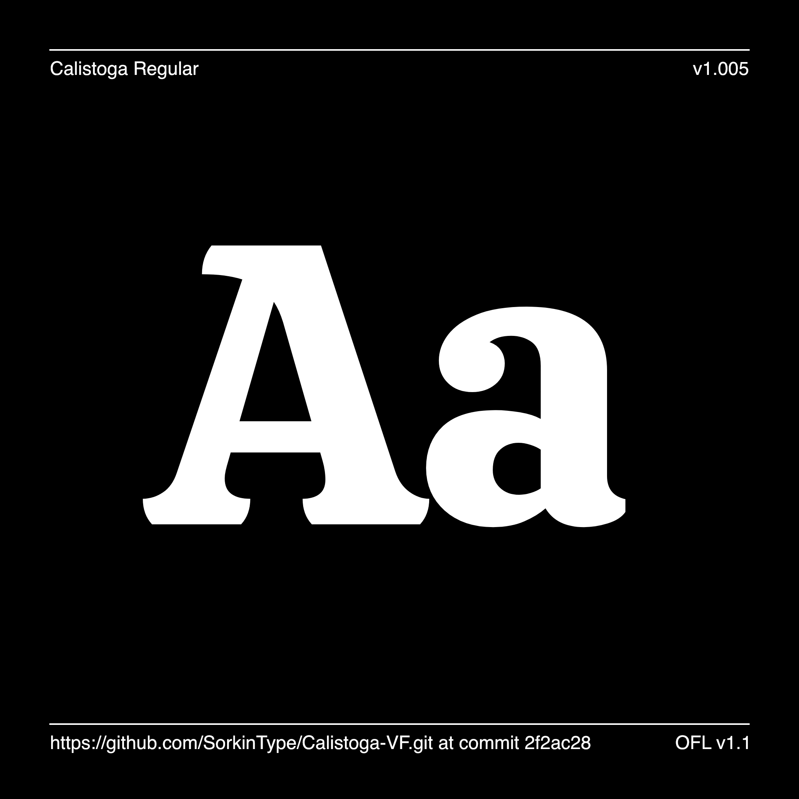

# Calistoga

[![][Fontbakery]](https://SorkinType.github.io/Calistoga/fontbakery/fontbakery-report.html)
[![][Universal]](https://SorkinType.github.io/Calistoga/fontbakery/fontbakery-report.html)
[![][GF Profile]](https://SorkinType.github.io/Calistoga/fontbakery/fontbakery-report.html)
[![][Outline Correctness]](https://SorkinType.github.io/Calistoga/fontbakery/fontbakery-report.html)
[![][Shaping]](https://SorkinType.github.io/Calistoga/fontbakery/fontbakery-report.html)

[Fontbakery]: https://img.shields.io/endpoint?url=https%3A%2F%2Fraw.githubusercontent.com%2FSorkinType%2FCalistoga%2Fgh-pages%2Fbadges%2Foverall.json
[GF Profile]: https://img.shields.io/endpoint?url=https%3A%2F%2Fraw.githubusercontent.com%2FSorkinType%2FCalistoga%2Fgh-pages%2Fbadges%2FGoogleFonts.json
[Outline Correctness]: https://img.shields.io/endpoint?url=https%3A%2F%2Fraw.githubusercontent.com%2FSorkinType%2FCalistoga%2Fgh-pages%2Fbadges%2FOutlineCorrectnessChecks.json
[Shaping]: https://img.shields.io/endpoint?url=https%3A%2F%2Fraw.githubusercontent.com%2FSorkinType%2FCalistoga%2Fgh-pages%2Fbadges%2FShapingChecks.json
[Universal]: https://img.shields.io/endpoint?url=https%3A%2F%2Fraw.githubusercontent.com%2FSorkinType%2FCalistoga%2Fgh-pages%2Fbadges%2FUniversal.json

Calistoga is a cheerful, space saving display typeface. It was inspired by Oscar M. Bryn's lettering as seen on the posters made for the Western US based Santa Fe Railroad.

Calistoga includes proportional, tabular, old style and lining figures. It also offers fractions, superiors, inferiors, a broad range of symbols, and it includes case sensitive forms.

Calistoga is an original typeface designed by Yvonne Schuttler. Eben Sorkin expanded the language support and refined the design in 2018. Still more languages were added in 2022.

Calistoga is published by Sorkin Type Co.

## About

Sorkin Type Co. makes fonts.

## Building

Fonts are built automatically by GitHub Actions - take a look in the "Actions" tab for the latest build.

If you want to build fonts manually on your own computer:

* `make build` will produce font files.
* `make test` will run [FontBakery](https://github.com/googlefonts/fontbakery)'s quality assurance tests.
* `make proof` will generate HTML proof files.

The proof files and QA tests are also available automatically via GitHub Actions - look at https://SorkinType.github.io/Calistoga.

## Changelog

When you update your font (new version or new release), please report all notable changes here, with a date.
[Font Versioning](https://github.com/googlefonts/gf-docs/tree/main/Spec#font-versioning) is based on semver. 
Changelog example:

**26 May 2021. Version 1.007**
- MAJOR Font turned to a variable font.
- SIGNIFICANT Kerning improved.
- SIGNIFICANT Language support improved.

## License

This Font Software is licensed under the SIL Open Font License, Version 1.1.
This license is available with a FAQ at
https://scripts.sil.org/OFL

## Repository Layout

This font repository structure is inspired by [Unified Font Repository v0.3](https://github.com/unified-font-repository/Unified-Font-Repository), modified for the Google Fonts workflow.
